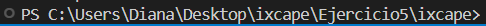

# Instrucciones

## Para descargar:
- Abrir el cuadrado verde "<> Code"
- Hacer clic en "Download ZIP"
- Descomprimir el archivo

## En Visual Studio Code
- Abrir el proyecto
- Sacar la terminal con el comando "ctrl + j"
- Hay que moverse a la carpeta "IXCAPE", dependiendo en qué carpeta está hay que correr más o menos veces el comando:
    "cd _[nombre de siguiente carpeta]_"

    Hasta que la ruta esté algo asi:
    
- Dentro de la carpeta "ixcape" correr:
    "npm install react-router-dom"

## Para correr el programa
En esta misma ruta:
    

correr el comando:
    "npm start"

Ese comando abrirá el navegador con un _localhost_. Si necesitan hacer un cambio, modifiquen el archivo, lo guardan y se va a aplicar inmediatamente al proyecto que está corriendo en el _localhost_.